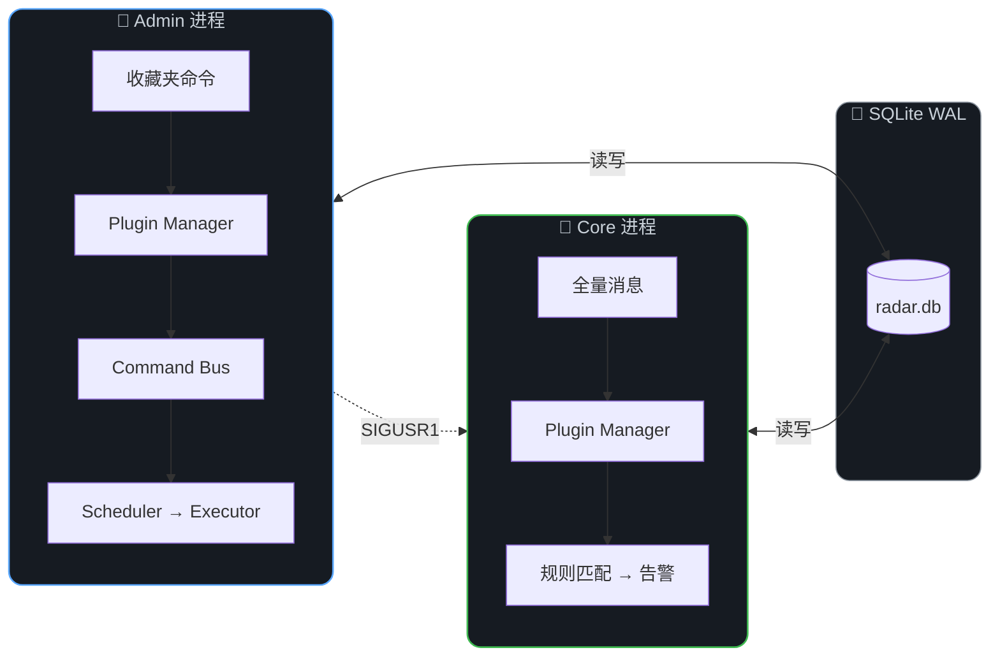
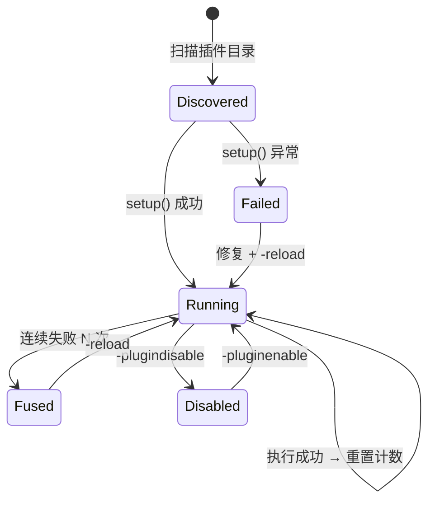

<div align="center">


<br/>

<a href="https://git.io/typing-svg"></a>

<br/><br/>

<a href="#-快速开始"></a>&nbsp;
<a href="#-架构"></a>&nbsp;
<a href="#-插件系统"></a>&nbsp;
<a href="#%EF%B8%8F-命令手册"></a>&nbsp;
<a href="https://github.com/chenmo8848/TG-Radar-Plugins"></a>

<br/><br/>


&nbsp;

&nbsp;

&nbsp;

&nbsp;


</div>

<br/>

## 🚀 快速开始

```bash
bash <(curl -sL https://raw.githubusercontent.com/chenmo8848/TG-Radar/main/install.sh)
```

> [!TIP]
> 全新 VPS（Ubuntu / Debian）以 root 执行。一条命令完成全部部署流程。

<table><tr><td>

**自动执行流程**

```
① 安装系统依赖        ④ Telegram 授权
② 拉取核心 + 插件仓库  ⑤ 首次同步分组数据
③ 创建 Python 环境     ⑥ 写入 systemd 并启动
```

</td></tr></table>

<details>
<summary>&nbsp;📋&nbsp;&nbsp;<b>手动部署</b></summary>
<br/>

```bash
git clone https://github.com/chenmo8848/TG-Radar.git && cd TG-Radar
python3 -m venv venv && venv/bin/pip install -r requirements.txt
cp config.example.json config.json && nano config.json      # 填入 api_id / api_hash
PYTHONPATH=src venv/bin/python3 src/bootstrap_session.py     # Telegram 授权
PYTHONPATH=src venv/bin/python3 src/sync_once.py             # 首次同步
bash deploy.sh install-services                               # 写入 systemd
systemctl start tg-radar-admin tg-radar-core                  # 启动
```

</details>

<br/>

## 🏗 架构



<table>
<tr><td width="50%">

**Admin 进程**
- 接收收藏夹命令，分发给插件处理
- CommandBus → Scheduler → Executor 后台任务链
- 单 TelegramClient，杜绝双客户端竞争

</td><td width="50%">

**Core 进程**
- 监听所有群消息，执行插件钩子
- 关键词匹配 → 告警发送
- SIGUSR1 信号热重载，零停机

</td></tr>
</table>

<br/>

## ✨ 核心特性

<table>
<tr>
<td width="50%">

> **🧩 &nbsp;全解耦插件架构**
>
> 所有业务功能以独立插件运行。每个插件拥有独立配置、独立日志、独立生命周期。崩溃不影响其他插件，`-reload` 秒级恢复。

> **⚡ &nbsp;高性能消息处理**
>
> 预检前置：99% 消息在匹配 chat_id 时即跳过，零 API 调用。命中后才懒加载 chat / sender。钩子 `asyncio.gather` 并行执行。

</td>
<td width="50%">

> **🔄 &nbsp;三层同步机制**
>
> | 层级 | 触发 | 延迟 |
> |:-----|:-----|:-----|
> | 🟢 实时 | 分组变动事件 | ~3s |
> | 🔵 手动 | `-sync` | 即时 |
> | ⚪ 定时 | 每日自动 | ≤24h |

> **🛡 &nbsp;稳定性保障**
>
> Session 损坏自动恢复 · 插件错误熔断 · 连续失败自动停用 · 异常捕获写入独立日志

</td>
</tr>
</table>

<br/>

## 🧩 插件系统

> [!NOTE]
> 核心只提供基础设施。所有业务功能均为可热重载的独立插件。
>
> 📦 **完整插件列表与开发文档** → [**TG-Radar-Plugins**](https://github.com/chenmo8848/TG-Radar-Plugins)

### 已有插件

| 插件 | 类型 | 功能 | 配置项 |
|:-----|:-----|:-----|:-------|
| `system_panel` | Admin · 内置 | help · plugins · reload · pluginconfig | — |
| `general` | Admin | ping · status · version · config · log · jobs | `panel_auto_delete_seconds` `recycle_command_seconds` |
| `folders` | Admin | folders · rules · enable · disable | — |
| `rules` | Admin | addrule · setrule · delrule · setnotify · setalert · setprefix | — |
| `routes` | Admin | routes · addroute · delroute · sync · routescan | `auto_sync_enabled/time` `auto_route_enabled/time` |
| `system` | Admin | restart · update（自动检测变更并重载） | `restart_delay_seconds` |
| `chatinfo` | Admin | 转发消息识别群 ID · 分组变动实时同步 | — |
| `keyword_monitor` | Core | 关键词匹配 · 多规则告警 · 严重等级 | `bot_filter` `max_preview_length` |

### Plugin SDK

```python
from tgr.plugin_sdk import PluginContext

PLUGIN_META = {"name": "hello", "version": "1.0.0", "kind": "admin"}

def setup(ctx: PluginContext):
    @ctx.command("hello", summary="打招呼", usage="hello", category="示例")
    async def handler(app, event, args):
        await ctx.reply(event, ctx.ui.panel("Hello", [ctx.ui.section("", ["👋"])]))
```

<details>
<summary>&nbsp;📚&nbsp;&nbsp;<b>SDK 完整接口</b></summary>
<br/>

| 分类 | 接口 | 说明 |
|:-----|:-----|:-----|
| **配置** | `ctx.config.get(key, default)` | 读取插件配置 |
| | `ctx.config.set(key, value)` | 写入并持久化到 `configs/name.json` |
| | `ctx.config.all()` | 全部配置 |
| **数据** | `ctx.db.list_folders()` | 分组列表 |
| | `ctx.db.get_rules_for_folder(name)` | 规则列表 |
| | `ctx.db.log_event(level, action, detail)` | 写入日志 |
| | `ctx.db.get_runtime_stats()` | 运行统计 |
| **渲染** | `ctx.ui.panel(title, sections, footer)` | HTML 面板 |
| | `ctx.ui.section(title, rows)` | 区块 |
| | `ctx.ui.bullet(label, value)` | 键值行 |
| | `ctx.ui.escape(text)` | HTML 转义 |
| **任务** | `ctx.bus.submit_job(kind, payload, ...)` | 提交后台任务 |
| **日志** | `ctx.log.info / warning / error` | 插件独立日志 |
| **通信** | `ctx.emit(event, data)` | 发布事件 |
| | `@ctx.on(event)` | 订阅事件 |
| **注册** | `@ctx.command(name, ...)` | 注册命令 |
| | `@ctx.hook(name, ...)` | 注册消息钩子 |
| | `@ctx.cleanup` | 卸载清理 |
| | `@ctx.healthcheck` | 健康检查 |
| **工具** | `ctx.client` | Telethon 客户端 |
| | `ctx.reply(event, text)` | 统一回复 |

</details>

<details>
<summary>&nbsp;♻️&nbsp;&nbsp;<b>插件生命周期</b></summary>
<br/>



</details>

<br/>

## ⌨️ 命令手册

> 在 Telegram **收藏夹**中发送，默认前缀 `-`

<details open>
<summary>&nbsp;📋&nbsp;&nbsp;<b>通用</b></summary>

| 命令 | 说明 |
|:-----|:-----|
| `-help` | 命令列表（由已加载插件实时生成） |
| `-ping` | 在线心跳 |
| `-status` | 系统状态 |
| `-version` | 版本信息 |
| `-config` | 核心配置 |
| `-log [scope] [n]` | 事件日志（`important` `normal` `all`） |
| `-jobs` | 后台任务队列 |

</details>

<details>
<summary>&nbsp;📁&nbsp;&nbsp;<b>分组管理</b></summary>

| 命令 | 说明 |
|:-----|:-----|
| `-folders` | 查看全部分组 |
| `-rules 分组名` | 查看分组规则 |
| `-enable 分组名` | 开启监控 |
| `-disable 分组名` | 关闭监控 |

</details>

<details>
<summary>&nbsp;📝&nbsp;&nbsp;<b>规则维护</b></summary>

| 命令 | 说明 |
|:-----|:-----|
| `-addrule 分组 规则名 关键词...` | 追加关键词（支持正则） |
| `-setrule 分组 规则名 表达式` | 覆盖规则 |
| `-delrule 分组 规则名 [词...]` | 删除规则或部分词项 |
| `-setnotify ID / off` | 系统通知频道 |
| `-setalert ID / off` | 默认告警频道 |
| `-setprefix 前缀` | 修改命令前缀 |

> [!TIP]
> 支持混合正则：`-addrule 分组 规则A "台(?:[1-9]|[一二三四五六七八九])"`

</details>

<details>
<summary>&nbsp;🔄&nbsp;&nbsp;<b>同步与归纳</b></summary>

| 命令 | 说明 |
|:-----|:-----|
| `-sync` | 手动同步 |
| `-routes` | 查看归纳规则 |
| `-addroute 分组 关键词...` | 新增归纳规则 |
| `-delroute 分组` | 删除归纳规则 |
| `-routescan` | 手动扫描 |

</details>

<details>
<summary>&nbsp;🧩&nbsp;&nbsp;<b>插件管理</b></summary>

| 命令 | 说明 |
|:-----|:-----|
| `-plugins` | 全部插件状态 |
| `-reload 名称` | 热重载插件 |
| `-pluginreload` | 全量重载 |
| `-pluginenable 名称` | 启用 |
| `-plugindisable 名称` | 停用（持久化） |
| `-pluginconfig 名称 [键] [值]` | 查看 / 修改配置 |

</details>

<details>
<summary>&nbsp;⚙️&nbsp;&nbsp;<b>系统 & 工具</b></summary>

| 命令 | 说明 |
|:-----|:-----|
| `-restart` | 重启双服务 |
| `-update` | 拉取更新 + 自动重载 |
| *(转发消息到收藏夹)* | 自动识别来源群 ID |

</details>

### 终端管理器

```bash
TR                # 交互菜单
TR status         # 服务状态
TR restart        # 重启双服务
TR logs admin     # Admin 日志
TR logs core      # Core 日志
TR update         # 拉取更新
TR doctor         # 环境自检
TR reauth         # 重新授权
```

<br/>

## 🔍 获取群 ID

从任意群 / 频道 **转发一条消息到收藏夹**，系统自动回复：

<table><tr><td>

```
TG-Radar · 群 ID 识别

来源信息
· 名称：XXX 交流群
· ID：-1001234567890
· 类型：超级群

快捷操作
  设为告警频道: -setalert -1001234567890
  设为通知频道: -setnotify -1001234567890
```

</td></tr></table>

> [!IMPORTANT]
> 转发时请选择**普通用户**发的消息。Bot 发的消息会识别出 Bot 本身而非所在群。

<br/>

## 📂 项目结构

<details>
<summary>&nbsp;展开查看&nbsp;</summary>
<br/>

```
TG-Radar/
│
├── config.json                     核心配置（10 项基础设施参数）
├── configs/                        插件配置（自动生成）
│   ├── general.json
│   ├── routes.json
│   └── keyword_monitor.json
│
├── runtime/
│   ├── radar.db                    SQLite WAL
│   ├── sessions/                   Telegram session
│   └── logs/
│       ├── admin.log
│       ├── core.log
│       └── plugins/               插件独立日志
│
├── src/tgr/
│   ├── plugin_sdk.py              ★ 插件 SDK 入口
│   ├── _plugin_exports.py         受控子接口
│   ├── core/plugin_system.py      插件引擎
│   ├── admin_service.py           Admin 服务
│   ├── core_service.py            Core 服务
│   └── ...
│
├── plugins-external/              外部插件仓库
├── install.sh                     一键部署
└── deploy.sh                      终端管理器
```

</details>

<details>
<summary>&nbsp;⚙️&nbsp;&nbsp;<b>核心配置说明</b></summary>
<br/>

| 参数 | 类型 | 说明 |
|:-----|:-----|:-----|
| `api_id` | int | Telegram API ID（[获取](https://my.telegram.org)） |
| `api_hash` | string | Telegram API Hash |
| `cmd_prefix` | string | 命令前缀，默认 `-` |
| `service_name_prefix` | string | systemd 服务名前缀 |
| `operation_mode` | string | `stable` / `balanced` / `aggressive` |
| `global_alert_channel_id` | int \| null | 默认告警频道 |
| `notify_channel_id` | int \| null | 通知频道（null = 收藏夹） |
| `repo_url` | string | 核心仓库 URL |
| `plugins_repo_url` | string | 插件仓库 URL |
| `plugins_dir` | string | 插件目录路径 |

</details>

<br/>

## ⚠️ 免责声明

<table><tr><td>

本项目仅供 **学习与技术研究** 用途，使用者须自行确保其行为符合所在国家或地区的法律法规。

- 开发者不对因使用本工具所导致的任何直接或间接损失承担责任。
- 用户应自行承担使用风险，包括但不限于 Telegram 账号封禁、数据丢失等。
- 本项目不收集、存储或传输任何用户数据至第三方。所有数据仅存储在用户自己的设备上。
- 严禁将本工具用于任何非法活动，包括但不限于未经授权的监控、骚扰、诈骗等行为。
- 使用本项目即表示您已阅读、理解并同意上述条款。

</td></tr></table>

<br/>

---

<div align="center">


<br/>

<a href="https://github.com/chenmo8848/TG-Radar"></a>
&nbsp;
<a href="https://github.com/chenmo8848/TG-Radar-Plugins"></a>

<br/><br/>

<sub>Built with Telethon · SQLite WAL · APScheduler</sub>

</div>
