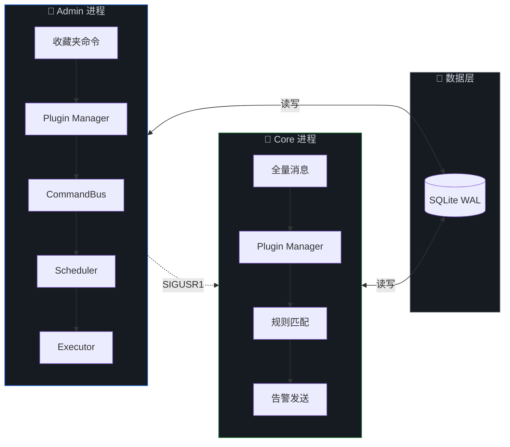
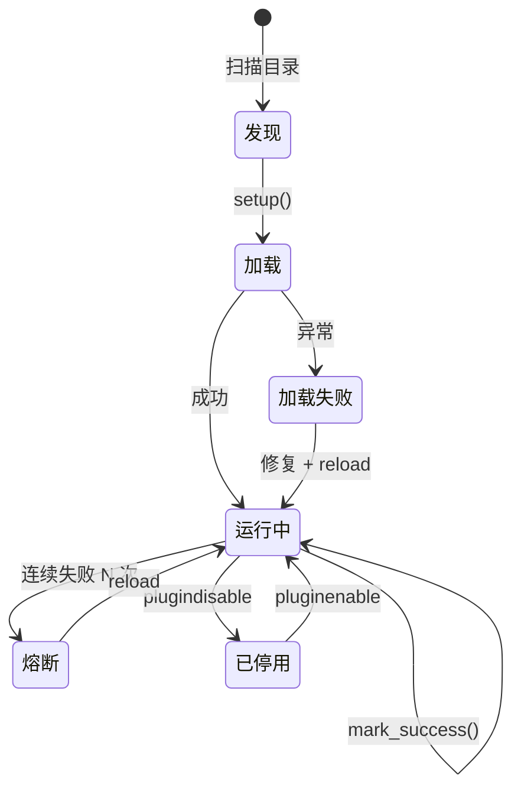

<div align="center">

<!-- Dynamic Header -->


<!-- Badges -->
<p>


</p>

<!-- Typing SVG -->
<a href="https://git.io/typing-svg"></a>

<br/>

<!-- Quick Links -->
<a href="#-一键部署"><kbd>🚀 部署</kbd></a>&nbsp;&nbsp;
<a href="#-架构总览"><kbd>🏗️ 架构</kbd></a>&nbsp;&nbsp;
<a href="#-插件系统"><kbd>🧩 插件</kbd></a>&nbsp;&nbsp;
<a href="#-命令速查"><kbd>⌨️ 命令</kbd></a>&nbsp;&nbsp;
<a href="#-开发指南"><kbd>📖 开发</kbd></a>

</div>

<br/>

## 🚀 一键部署

```bash
bash <(curl -sL https://raw.githubusercontent.com/chenmo8848/TG-Radar/main/install.sh)
```

> [!TIP]
> 在全新 VPS（Ubuntu / Debian）上以 root 执行即可。脚本自动完成全部流程：
>
> `安装依赖` → `拉取仓库` → `创建环境` → `写入配置` → `Telegram 授权` → `首次同步` → `启动服务`

<details>
<summary><kbd>📋 手动部署步骤</kbd></summary>
<br/>

```bash
# 1. 克隆仓库
git clone https://github.com/chenmo8848/TG-Radar.git
cd TG-Radar

# 2. 安装依赖
python3 -m venv venv
venv/bin/pip install -r requirements.txt

# 3. 配置（填入 api_id / api_hash）
cp config.example.json config.json
nano config.json

# 4. 授权 Telegram
PYTHONPATH=src venv/bin/python3 src/bootstrap_session.py

# 5. 首次同步
PYTHONPATH=src venv/bin/python3 src/sync_once.py

# 6. 写入 systemd 并启动
bash deploy.sh install-services
systemctl start tg-radar-admin tg-radar-core
```

</details>

<br/>

## 🏗️ 架构总览



> **Admin** 处理命令交互与后台任务，**Core** 监听消息并发送告警。
> 两个进程通过 SQLite WAL 共享数据，通过 SIGUSR1 信号触发热重载。

<br/>

## ✨ 核心特性

<table>
<tr>
<td width="50%">

### 🧩 全解耦插件
- 所有业务功能均为独立插件
- 热重载：`-reload 插件名` 秒级生效
- 错误熔断：连续失败自动停用
- 独立配置：`configs/插件名.json`
- 独立日志：`logs/plugins/插件名.log`

### ⚡ 性能优化
- 99% 消息零开销跳过（预检前置）
- 关键词匹配后才调用 TG API（懒加载）
- 消息钩子 `asyncio.gather` 并行执行
- 同步期间每 10 个 dialog 让出事件循环

</td>
<td width="50%">

### 🔄 三层同步机制
| 层级 | 触发方式 | 延迟 |
|:-----|:---------|:-----|
| 🟢 实时 | 分组变动事件 | ~3s |
| 🔵 手动 | `-sync` 命令 | 即时 |
| ⚪ 定时 | 每日自动执行 | ≤24h |

### 🛡️ 稳定性保障
- 单 Client 模型（杜绝双客户端竞争）
- Session 损坏自动从 Core 恢复
- 插件错误不影响核心运行
- 所有异常捕获并记录日志

</td>
</tr>
</table>

<br/>

## 🧩 插件系统

### 插件列表

> [!NOTE]
> 所有业务功能以插件形式运行，核心只提供基础设施。

| 插件 | 类型 | 功能 | 自有配置 |
|:-----|:-----|:-----|:---------|
| `system_panel` | Admin · 内置 | help · plugins · reload · pluginconfig | — |
| `general` | Admin | ping · status · version · config · log · jobs | `panel_auto_delete_seconds` `recycle_command_seconds` |
| `folders` | Admin | folders · rules · enable · disable | — |
| `rules` | Admin | addrule · setrule · delrule · setnotify · setalert · setprefix | — |
| `routes` | Admin | routes · addroute · delroute · sync · routescan | `auto_sync_enabled` `auto_sync_time` `auto_route_enabled` `auto_route_time` |
| `system` | Admin | restart · update | `restart_delay_seconds` |
| `chatinfo` | Admin | 转发识别群 ID · 分组变动实时同步 | — |
| `keyword_monitor` | Core | 关键词匹配 · 告警发送 | `bot_filter` `max_preview_length` |

### Plugin SDK

插件唯一入口，一行 import 即可开发：

```python
from tgr.plugin_sdk import PluginContext

PLUGIN_META = {"name": "my_plugin", "version": "1.0.0", "kind": "admin"}

def setup(ctx: PluginContext):
    @ctx.command("hello", summary="打招呼", usage="hello", category="示例")
    async def handler(app, event, args):
        await ctx.reply(event, ctx.ui.panel("Hello", [ctx.ui.section("", ["👋"])]))
```

<details>
<summary><kbd>📚 SDK 完整接口</kbd></summary>
<br/>

| 接口 | 说明 | 示例 |
|:-----|:-----|:-----|
| `ctx.config.get(key)` | 读取插件配置 | `ctx.config.get("bot_filter", True)` |
| `ctx.config.set(key, val)` | 写入配置（自动持久化） | `ctx.config.set("delay", 5)` |
| `ctx.db` | 白名单数据库方法 | `ctx.db.list_folders()` |
| `ctx.ui` | HTML 渲染工具 | `ctx.ui.panel("标题", [...])` |
| `ctx.bus` | 提交后台任务 | `ctx.bus.submit_job("sync", ...)` |
| `ctx.log` | 插件独立日志 | `ctx.log.info("执行完成")` |
| `ctx.client` | Telethon 客户端 | `await ctx.client.send_message(...)` |
| `ctx.emit(event, data)` | 发布事件 | `await ctx.emit("rule_changed", {...})` |
| `@ctx.command(...)` | 注册命令 | 装饰器，见上方示例 |
| `@ctx.hook(...)` | 注册消息钩子 | `@ctx.hook("name", summary="...", order=100)` |
| `@ctx.on(event)` | 订阅事件总线 | `@ctx.on("folder_changed")` |
| `@ctx.cleanup` | 注册卸载清理 | `@ctx.cleanup` `async def clean(): ...` |
| `@ctx.healthcheck` | 注册健康检查 | `@ctx.healthcheck` `async def check(app): ...` |
| `ctx.reply(event, text)` | 统一回复 | `await ctx.reply(event, "OK")` |

</details>

<details>
<summary><kbd>📂 插件配置文件</kbd></summary>
<br/>

每个声明了 `config_schema` 的插件会自动在 `configs/` 目录生成独立 JSON 配置文件：

```
configs/
├── general.json           # {"panel_auto_delete_seconds": 45, "recycle_command_seconds": 8}
├── routes.json            # {"auto_sync_enabled": true, "auto_sync_time": "03:40", ...}
├── keyword_monitor.json   # {"bot_filter": true, "max_preview_length": 760}
└── system.json            # {"restart_delay_seconds": 2.0}
```

通过 Telegram 命令管理：
```
-pluginconfig routes                          # 查看配置
-pluginconfig routes auto_sync_time 04:00     # 修改配置
```

也可以直接编辑 JSON 文件后 `-reload 插件名`。

</details>

<details>
<summary><kbd>♻️ 插件生命周期</kbd></summary>
<br/>



</details>

<br/>

## ⌨️ 命令速查

### Telegram 命令

> 在收藏夹中发送，默认前缀 `-`

<details open>
<summary><kbd>📋 通用</kbd></summary>

| 命令 | 说明 |
|:-----|:-----|
| `-help` | 查看命令列表 |
| `-ping` | 在线心跳检测 |
| `-status` | 系统状态详情 |
| `-version` | 版本与部署信息 |
| `-config` | 核心配置速览 |
| `-log [scope] [n]` | 事件日志 |
| `-jobs` | 后台任务队列 |

</details>

<details>
<summary><kbd>📁 分组管理</kbd></summary>

| 命令 | 说明 |
|:-----|:-----|
| `-folders` | 查看全部分组 |
| `-rules 分组名` | 查看分组规则 |
| `-enable 分组名` | 开启分组监控 |
| `-disable 分组名` | 关闭分组监控 |

</details>

<details>
<summary><kbd>📝 规则维护</kbd></summary>

| 命令 | 说明 |
|:-----|:-----|
| `-addrule 分组 规则名 关键词...` | 追加关键词到规则 |
| `-setrule 分组 规则名 表达式` | 覆盖整条规则 |
| `-delrule 分组 规则名 [词...]` | 删除规则或部分词项 |
| `-setnotify ID/off` | 设置系统通知频道 |
| `-setalert ID/off` | 设置默认告警频道 |
| `-setprefix 新前缀` | 修改命令前缀 |

> **支持正则**：`-addrule 分组 规则A "台(?:[1-9]\|[一二三四五六七八九])"`

</details>

<details>
<summary><kbd>🔄 同步与归纳</kbd></summary>

| 命令 | 说明 |
|:-----|:-----|
| `-sync` | 手动同步分组数据 |
| `-routes` | 查看自动归纳规则 |
| `-addroute 分组 关键词...` | 新增归纳规则 |
| `-delroute 分组` | 删除归纳规则 |
| `-routescan` | 手动归纳扫描 |

</details>

<details>
<summary><kbd>🧩 插件管理</kbd></summary>

| 命令 | 说明 |
|:-----|:-----|
| `-plugins` | 查看全部插件状态 |
| `-reload 插件名` | 热重载单个插件 |
| `-pluginreload` | 全量重载 |
| `-pluginenable 插件名` | 启用插件 |
| `-plugindisable 插件名` | 停用插件（持久化） |
| `-pluginconfig 插件 [键] [值]` | 查看 / 修改插件配置 |

</details>

<details>
<summary><kbd>⚙️ 系统</kbd></summary>

| 命令 | 说明 |
|:-----|:-----|
| `-restart` | 重启双服务 |
| `-update` | 拉取更新 + 自动重载变更插件 |

</details>

<details>
<summary><kbd>🔧 工具</kbd></summary>

| 命令 | 说明 |
|:-----|:-----|
| *(转发消息到收藏夹)* | 自动识别来源群 ID |

</details>

### 终端管理

```bash
TR                # 交互菜单
TR status         # 服务状态
TR start          # 启动双服务
TR stop           # 停止双服务
TR restart        # 重启双服务
TR logs admin     # Admin 日志
TR logs core      # Core 日志
TR update         # 拉取更新并重启
TR doctor         # 环境自检
TR reauth         # 重新授权 Telegram
```

<br/>

## 📖 开发指南

<details>
<summary><kbd>📁 目录结构</kbd></summary>
<br/>

```
TG-Radar/
├── config.json                    # 核心配置（10 项基础设施参数）
├── config.example.json
├── configs/                       # 插件配置目录（自动生成）
│   ├── general.json
│   ├── routes.json
│   └── keyword_monitor.json
│
├── runtime/
│   ├── radar.db                   # SQLite WAL 数据库
│   ├── sessions/                  # Telegram session 文件
│   │   ├── tg_radar_admin.session
│   │   └── tg_radar_core.session
│   ├── logs/
│   │   ├── admin.log              # Admin 进程日志
│   │   ├── core.log               # Core 进程日志
│   │   └── plugins/               # 插件独立日志
│   │       ├── chatinfo.log
│   │       ├── general.log
│   │       └── keyword_monitor.log
│   └── backups/
│
├── src/
│   ├── radar_admin.py             # Admin 入口
│   ├── radar_core.py              # Core 入口
│   ├── bootstrap_session.py       # 授权向导
│   ├── sync_once.py               # 一次性同步
│   └── tgr/
│       ├── plugin_sdk.py          # ★ 插件唯一 import 入口
│       ├── _plugin_exports.py     # 受控子接口 (db/ui/bus)
│       ├── core/
│       │   └── plugin_system.py   # 插件系统核心引擎
│       ├── admin_service.py       # Admin 服务
│       ├── core_service.py        # Core 服务
│       ├── config.py              # 配置系统
│       ├── db.py                  # 数据层
│       ├── command_bus.py         # 命令总线
│       ├── scheduler.py           # 调度器
│       ├── executors.py           # 任务执行器
│       ├── sync_logic.py          # 同步引擎
│       ├── telegram_utils.py      # 渲染 & TG 工具
│       └── builtin_plugins/       # 内置插件
│
├── plugins-external/              # 外部插件仓库
│   └── TG-Radar-Plugins/
│       └── plugins/
│           ├── admin/             # Admin 插件
│           └── core/              # Core 插件
│
├── install.sh                     # 一键安装脚本
├── deploy.sh                      # TR 终端管理器
└── requirements.txt
```

</details>

<details>
<summary><kbd>⚙️ 核心配置说明</kbd></summary>
<br/>

`config.json` 只保留基础设施级参数，所有业务设置由插件各自管理：

| 参数 | 类型 | 说明 |
|:-----|:-----|:-----|
| `api_id` | int | Telegram API ID（[获取地址](https://my.telegram.org)） |
| `api_hash` | string | Telegram API Hash |
| `cmd_prefix` | string | 命令前缀，默认 `-` |
| `service_name_prefix` | string | systemd 服务名前缀 |
| `operation_mode` | string | 运行模式：`stable` / `balanced` / `aggressive` |
| `global_alert_channel_id` | int \| null | 默认告警频道 ID |
| `notify_channel_id` | int \| null | 系统通知频道（null = 收藏夹） |
| `repo_url` | string | 核心仓库地址 |
| `plugins_repo_url` | string | 插件仓库地址 |
| `plugins_dir` | string | 插件目录路径 |

</details>

<details>
<summary><kbd>🧩 开发新插件</kbd></summary>
<br/>

**1. 创建文件**

```bash
cp plugin_template.py plugins-external/TG-Radar-Plugins/plugins/admin/my_plugin.py
```

**2. 编写插件**

```python
PLUGIN_META = {
    "name": "my_plugin",
    "version": "1.0.0",
    "description": "我的插件",
    "kind": "admin",                    # admin 或 core
    "config_schema": {
        "my_setting": {"type": "int", "default": 10, "description": "说明"},
    },
}

from tgr.plugin_sdk import PluginContext

def setup(ctx: PluginContext):
    @ctx.command("mycommand", summary="做某事", usage="mycommand [参数]", category="我的分类")
    async def handler(app, event, args):
        value = ctx.config.get("my_setting")
        ctx.log.info("执行命令, setting=%s", value)
        await ctx.reply(event, ctx.ui.panel("结果", [
            ctx.ui.section("输出", [ctx.ui.bullet("参数", args), ctx.ui.bullet("配置", value)]),
        ]))

    @ctx.on("rule_changed")
    async def on_rule(data):
        ctx.log.info("收到事件: %s", data)

    @ctx.healthcheck
    async def check(app):
        return "ok", "运行正常"

    @ctx.cleanup
    async def clean():
        ctx.log.info("清理完成")
```

**3. 加载**

```
-reload my_plugin
```

配置自动生成在 `configs/my_plugin.json`。

</details>

<br/>

## 🔍 获取群 ID

从任意群 / 频道 **转发一条消息到收藏夹**，系统自动回复：

```
TG-Radar · 群 ID 识别

来源信息
· 名称：XXX 交流群
· ID：-1001234567890
· 类型：超级群

快捷操作
  设为告警频道: -setalert -1001234567890
  设为通知频道: -setnotify -1001234567890
```

> [!IMPORTANT]
> 转发时请选择**普通用户发的消息**。如果转发的是 Bot 发的消息，识别出的是 Bot 本身而不是所在的群。

<br/>

---

<div align="center">


<sub>
<strong>TG-Radar</strong> · Built with Telethon · SQLite WAL · APScheduler
<br/>
<a href="https://github.com/chenmo8848/TG-Radar">Core</a> · <a href="https://github.com/chenmo8848/TG-Radar-Plugins">Plugins</a>
</sub>

</div>
